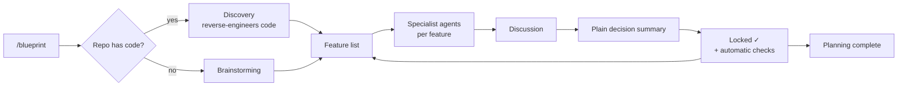

<p align="center">
  <h1 align="center">Blueprint</h1>
  <p align="center"><b>Think it through with Claude before you build.</b></p>
  <p align="center">Blueprint turns every design decision into a discussion with specialist agents, then locks it into an Obsidian vault that Claude reads every session — so nothing gets forgotten or silently contradicted.</p>
</p>

<p align="center">
  
  
  
  
</p>

---

## Why

Claude Code forgets everything between sessions. Plan Mode plans live and die inside one
chat. That's fine for a single task, but on a real project it causes a specific problem: in
week 1 you decide a feature uses JWT for auth; in week 6, Claude has no memory of that
decision and can quietly build a second, contradicting login flow.

Blueprint fixes this by making decisions **permanent and checked**. Every decision gets
discussed, locked, written to a vault, and verified against every other decision — automatically.

> Writing code is becoming cheap; **deciding well** is not. I believe engineers are becoming
> architects and decision-makers, with AI agents as specialists and builders. So the source of
> truth should be the written decisions: **waterfall for the thinking, agile for the building.**

## How it works



1. `/blueprint` sets up `vault-<project>/` in your repo. An empty repo starts a
   **Brainstorming** conversation; an existing codebase goes through **Discovery** first,
   which reverse-engineers it into draft features marked `needs-review`.
2. **Brainstorming** splits the project into the smallest sensible list of features, plus an
   order to discuss them in. Each feature gets an **importance** and an **effort** score
   (1–5), and you say which parts you care about most — your **focus**.
3. **Topic-Discussion** handles one feature at a time. It dispatches the **specialist
   agents** that fit that feature (a frontend agent for a UI feature, a database agent for
   storage, and so on). They bring back real options; you talk to Claude in plain words, and
   Claude relays your questions back to the specialists until they agree. A feature can split
   into sub-features, each with its own specialists.
4. Each discussion ends with one **plain decision summary**: what was decided, and whether
   each decision is **one-way** (hard to change later) or **two-way** (easy to change later).
   You confirm, and it becomes "✓ Locked."
5. **Hooks check every save automatically**: contradictions between features, a changelog
   (`_audit.md`), and a one-way safety rule.
6. Once everything is locked, planning is done and Claude **stops** — it never starts coding
   on its own. Implementation is a separate step. (The author pairs Blueprint with the
   *superpowers* plugin for that: Blueprint for discussion, your favourite build workflow for
   implementation.)

## Two modes

Asked once per feature:

| Mode | What happens |
|---|---|
| **Hands-on** | You confirm every decision summary yourself. |
| **Assisted** | Claude locks easy-to-change (two-way) decisions on its own. Anything one-way still comes back to you. |

The one-way rule is enforced by a `PreToolUse` hook. No permission mode can bypass it.

**Importance and focus shape each feature.** They are two separate signals:

- **Importance** is about the project. It sets how deep the discussion goes: more specialists
  and questions for the heart of the project, fewer for small supporting parts.
- **Focus** is about you. It sets which mode Claude recommends: hands-on for the parts you
  care about, assisted for the rest. It's saved per project in `local-profile.md`.

A designer building a portfolio site might set DESIGN to importance 5 and keep it in their
focus, while HOSTING (importance 3) goes to Claude. Hosting still gets a real specialist
discussion. You just don't review every detail of it.

## The vault

Every locked decision lives in `vault-<project>/`, plain Markdown and JSON, readable in
Obsidian:

| File | Holds |
|---|---|
| `FEATURE-NAME.md` | One feature's decisions |
| `_features.md` | The full feature list |
| `_queue.json` | What's left to discuss |
| `_current-task.md` | Live scratchpad for the feature in progress |
| `_full-context.md` | Full discussion history |
| `_audit.md` | Who changed which decision, when, and why |

A new Claude session reads the vault automatically at startup — the vault **is** Claude's
memory. Verified live: a fresh session with no chat history rebuilt every decision correctly
from the vault alone.

## What's inside the plugin

| Type | Name | What it does |
|---|---|---|
| Command | `/blueprint` | Sets up the vault and starts the pipeline |
| Command | `/deep-review` | Optional. Agents re-read all decisions and prose to catch subtle contradictions (costs tokens) |
| Skill | `using-blueprint` | Rules and routing, loaded every session |
| Skill | `brainstorming` | Splits a project into features |
| Skill | `discovery` | Reverse-engineers an existing codebase |
| Skill | `feature-detection` | Classifies new work on an existing project |
| Skill | `topic-discussion` | The discussion engine |
| Skill | `docs-management` | The vault's file format |
| Skill | `user-agent` | Hands-on/assisted mode + a learned global preference profile |
| Skill | `management-info` | Turns a manager's rules/preferences file into binding or soft input |
| Skill | `pre-publish-check` | Optional check of code vs. decisions before a push |
| Skill | `engineering-sheets` | Optional HTML visual reference built from the decisions |
| Agent | `vault-architect` | The only writer of vault files |
| Agent | `profile-updater` | Updates the global preference profile (`~/.claude/blueprint/profile.json`); always asks first |
| Agent | `sheet-designer` | Renders the engineering sheets |
| Hook | `SessionStart` | Orients every session: rules + current vault state |
| Hook | `PostToolUse` | Checks every decision save: vocabulary, conflicts, value inversion, changelog |
| Hook | `PreToolUse` | The one-way guard |

## Install

```
claude plugin marketplace add FreddyZeta1847/blueprint
cd your-project
claude plugin install blueprint@blueprint --scope project
```

Use `--scope user` instead to enable Blueprint in every project. Then start `claude` in your
project and type `/blueprint`.

Inside an active Claude Code session, the same steps are:

```
/plugin marketplace add FreddyZeta1847/blueprint
/plugin install blueprint@blueprint
```

To update:

```
claude plugin marketplace update blueprint
claude plugin update blueprint@blueprint
```

**Requirements:** Claude Code, Node.js (the hooks are Node scripts), git.

## Who it's for

Medium or long-lived projects, where a decision from month one still has to hold in month
six. For a quick script, plain Plan Mode is enough — Blueprint adds real discussion time, on
purpose.

## Good to know

- If your global `~/.claude/CLAUDE.md` describes a different planning workflow, or another
  plugin has its own brainstorming skill, it can compete with Blueprint. Blueprint's own
  rules say it should win inside a Blueprint project, but a user's global CLAUDE.md is
  strong. Keep global planning rules out of projects that use Blueprint.
- The optional parts — `/deep-review`, `pre-publish-check`, `engineering-sheets`,
  `discovery`, `management-info` — are less battle-tested than the core pipeline.
- Token cost is low by design: nearly every check is a plain script, free to run. Only the
  optional commands, specialist discussions, and the profile update spend tokens.

## Repository layout

```
.claude-plugin/   plugin.json, marketplace.json
commands/         blueprint.md, deep-review.md
skills/           10 skills (one folder each, SKILL.md)
agents/           vault-architect, profile-updater, sheet-designer
hooks/            hooks.json + orientation.js, file-watcher.js, one-way-guard.js
PROGRESS.md       public, sanitized log of design milestones
```

## Status

v1.1.0 — adds per-feature importance/effort scores and a per-project focus, which set
discussion depth and the mode recommendation.

v1.0.0 — the core pipeline (bootstrap, brainstorming, specialist discussions, locking and
automatic checks) has been run end-to-end on a real test project.
